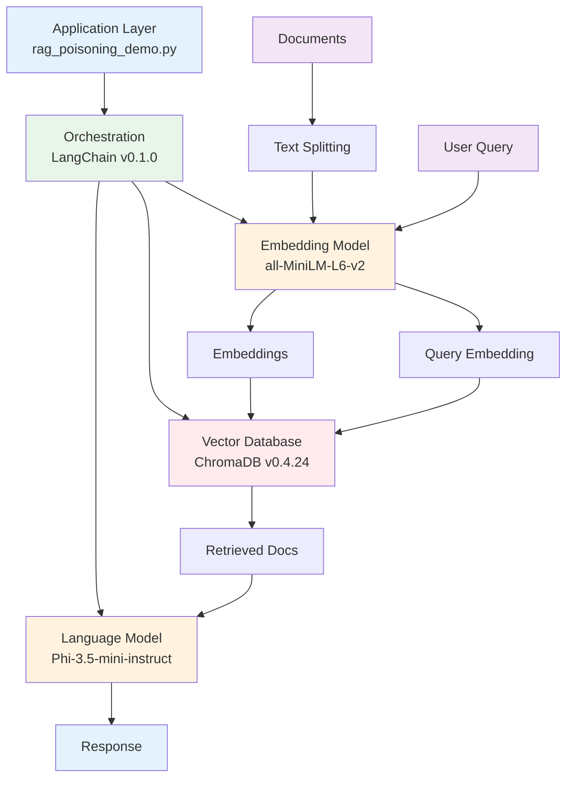

<h1 align="center">
  
The Hidden Parrot: RAG Poisoning POC  
</h1>
<div align="center">

# The Hidden Parrot: Stealthy Prompt Injection and Poisoning in RAG Systems via Vector Database Embeddings

<h4> Brought to you by Prompt Security, the Complete Platform for GenAI Security

</div>


<div align="center">
  


</div>


## Abstract

Retrieval Augmented Generation (RAG) systems are increasingly popular for enhancing Large Language Models (LLMs) with external, up-to-date knowledge. These systems typically rely on vector databases to store and retrieve relevant document embeddings that augment user prompts. This paper demonstrates a critical vulnerability in common RAG architectures: the potential for stealthy prompt injection and data poisoning through seemingly benign embeddings. We show that by embedding malicious instructions within documents ingested into the vector database, an attacker can manipulate the downstream behavior of the LLM. Our Proof-of-Concept (PoC), utilizing open-source RAG stacks (e.g., LangChain, Chroma/Weaviate), successfully demonstrates how a RAG system can be coerced into adopting a specific persona (e.g., "answering like a pirate") by retrieving a poisoned document. This research highlights a significant, yet easily exploitable, attack surface in RAG deployments and calls for urgent attention to mitigation strategies.
## Technical Stack



### Component Details

- **Language Model**: Phi-3.5-mini-instruct (Q4_K_M quantization, 4096 token context)
- **Embedding Model**: `sentence-transformers/all-MiniLM-L6-v2` (384-dimensional vectors)
- **Vector Database**: ChromaDB with SQLite backend, similarity search (top-k=3)
- **Orchestration**: LangChain RetrievalQA chain with "stuff" chain type
- **Environment**: Python 3.11+ with uv package manager
## Files Structure

```
ragpoc/
├── README.md                       # This file
├── requirements.txt                # Python dependencies
├── setup.sh                       # Environment setup script
├── test_setup.py                  # Setup verification script
├── src/                            # Source code
│   ├── config.py                   # Configuration
│   ├── utils.py                    # Utilities
│   ├── llm_factory.py              # LLM creation
│   ├── rag_system.py               # RAG components
│   ├── attack_demo.py              # Attack logic
│   ├── rag_poisoning_demo.py       # Main orchestration (refactored)
│   └── rag_poisoning_corpus.py     # Additional corpus utilities
├── data/                           # Data storage
│   └── chroma_db/                  # Vector database storage
├── logs/                           # Application logs
└── models/                         # Downloaded Model storage
    ├── embedding/                  # Downloaded Embedding models
    └── llm/                        # Downloaded Language models
```

## Quick Start

### For Local LLM Inference (Full Setup)
```bash
# Make setup script executable and run
chmod +x setup.sh
./setup.sh

# Activate virtual environment
source .venv/bin/activate

# Test the setup (supports --no-local for remote inference only)
python3 test_setup.py
```

### For Remote Inference Only (DeepSeek/Ollama)
If you plan to use only DeepSeek or Ollama for inference and don't need the local LLM model:
```bash
# Skip local LLM download to save ~4GB disk space
chmod +x setup.sh
./setup.sh --no-local

# Activate virtual environment
source .venv/bin/activate

# Test the setup (supports --no-local for remote inference only)
python3 test_setup.py --no-local
```

### 3. Run the Hidden Parrot Attack Demo

#### Local LLM Inference
```bash
# Run with local Llama 2 model (default)
python3 src/rag_poisoning_demo.py
```

#### Remote Inference Options

**Using Ollama:**
```bash
# Ollama configuration is in .env file (URL and model names)
# No additional setup needed - just run:
python3 src/rag_poisoning_demo.py --infer ollama
```

**Using DeepSeek API:**
```bash
# Copy the example keys and env file and add your API keys/configurations
cp .keys.example .keys
cp .env.example .env
# Edit .keys file and add your DeepSeek API key

# Run the demo with DeepSeek
python3 src/rag_poisoning_demo.py --infer deepseek
```

#### Platform-specific Inference
```bash
# Force specific platform/device
python3 src/rag_poisoning_demo.py --infer cpu     # Force CPU
python3 src/rag_poisoning_demo.py --infer cuda    # Force CUDA (if available)
python3 src/rag_poisoning_demo.py --infer darwin  # Force Apple Silicon (MPS)
```

## Key Research Contributions

1. **Novel Attack Vector**: First demonstration of prompt injection via vector database embeddings
2. **Practical Implementation**: Working proof-of-concept using LangChain and Chroma
3. **Security Analysis**: Comprehensive threat model and mitigation strategies
4. **Reproducible Results**: Complete experimental setup and code availability

## Document Sections

The complete research paper is contained in `research_paper/index.qmd` and organized into chapters under `research_paper/chapters/`. The paper includes:

- **Abstract & Introduction**: Problem motivation and research overview
- **Background**: RAG architectures, vector databases, and related work
- **Threat Model**: Attacker capabilities and goals
- **Methodology**: Experimental design and "Pirate Attack" implementation
- **Results**: Attack success metrics and analysis
- **Discussion**: Security implications and detection challenges
- **Mitigation**: Defensive strategies and countermeasures
- **Future Work**: Research directions and open problems
- **Appendix**: PoC implementation reference and document examples


## Requirements
### For Code Execution
- Python 3.11+
- uv Virtual environment support
- ~2GB disk space (for models and dependencies)
- **Additional for local LLM:** ~4GB additional space for Llama 2 model

### For Remote Inference
- **Ollama:** Ollama server (local or remote) with URL and model configured in `.env`
- **DeepSeek:** Valid API key configured in `.keys` file (copy from `.keys.example`)
- Both options significantly reduce local storage requirements

---

**⚠️ Responsible Research Notice**: This work is intended for legitimate security research and educational purposes. Please use these techniques responsibly and in accordance with applicable laws and ethical guidelines.